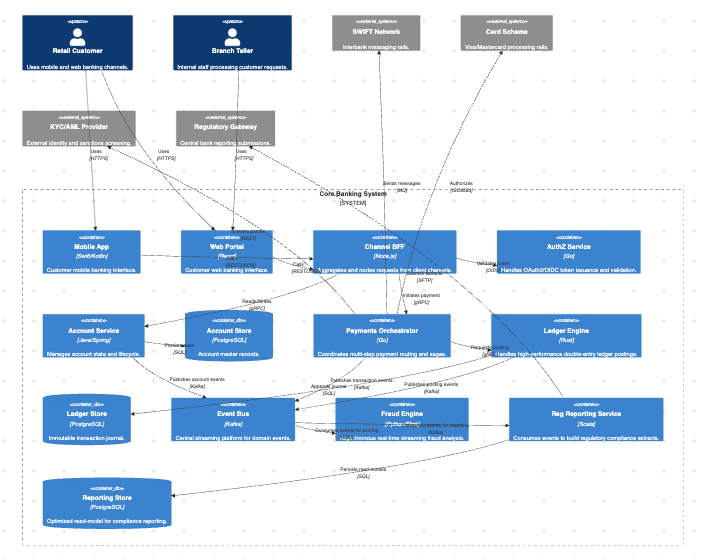
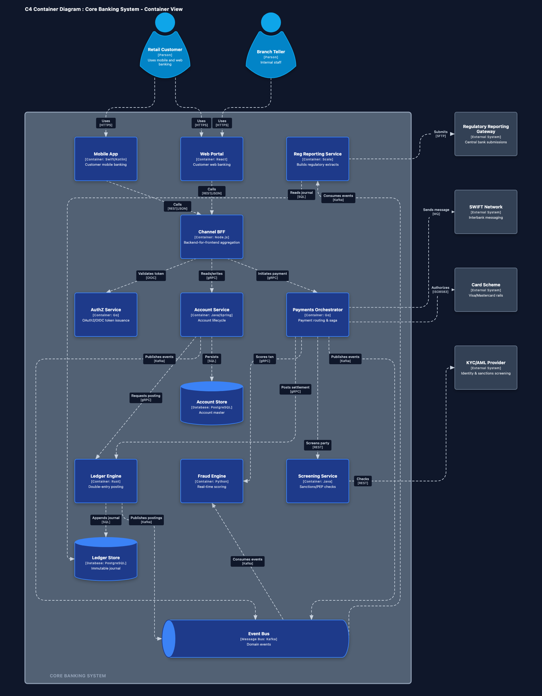
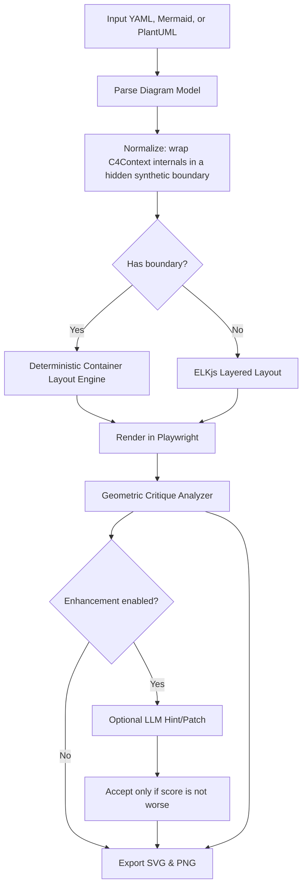

# Nudge

[](https://github.com/cookie-bytes/nudge/actions/workflows/test.yml)
[](LICENSE)
[](package.json)

**Deterministic C4 layout engine, with optional AI polish**

Nudge automatically produces clean, publication-ready C4 Model architecture diagrams. Its quality floor comes from deterministic layout rules: a custom Container Layout Engine for both context and container diagrams, orthogonal grid routing (A* pathfinding over a sparse orthogonal visibility graph) with rip-up-and-reroute, channel nudging, and collision-aware Connection Label placement. ELKjs remains the engine for flat diagrams with no person/external elements.

Local LLM reviewers are an optional enhancement layer. They can suggest connection label placement overrides for context and container diagrams, or ELKjs option patches for flat diagrams, but those suggestions are accepted only when they do not worsen the geometric score.

Nudge runs as a **CLI tool** for direct use from the terminal, and as a local **MCP server** so LLM clients like Claude Desktop can call it as a tool — generating and optimizing diagrams in a single conversational step.

---

## Example Output

| Before (Mermaid C4 Baseline) | After (Nudge Optimized) |
| :---: | :---: |
|  |  |

See the full comparison source in [docs/core-banking-single-boundary-comparison.md](docs/core-banking-single-boundary-comparison.md).

A second optimized container example — the search service — shows the grid router's orthogonal connection lines, with each connection label and arrowhead kept clear of its line so a dash always precedes the arrowhead:

<p align="center"></p>

---

## How It Works

Nudge is built around a deterministic renderer with an optional accept-only-if-not-worse enhancement pass:



1. **Ingestion**: Parses C4 Context or C4 Container diagrams from `.mermaid`, `.puml`/`.plantuml`, or `.yaml` specifications. C4Context diagrams are normalised by wrapping their internal architecture elements in a hidden synthetic boundary — persons and external systems stay outside — so context diagrams reuse the full container pipeline.
2. **Deterministic rendering**: Produces a complete baseline layout without needing cloud services. Context and container diagrams use Nudge's custom deterministic rules; flat diagrams without person/external elements use ELKjs.
3. **Geometric critique**: Measures DOM bounding boxes to detect Element Overlaps, Connection-Line Element Crossings, Connection-Label Element Crossings, poor aspect ratio, and tight spacing. Container routing uses A* pathfinding over a sparse orthogonal visibility graph, hardest-first routing, and rip-up-and-reroute to optimize line paths and avoid corridors.
4. **Optional enhancement**: When LLM calls are enabled, Nudge asks a local OpenAI-compatible model for small layout improvements. Container and context diagram hints are accepted only when the candidate score is no worse than the current accepted state. Flat diagram patches are applied through the existing critic loop.
5. **Export**: Writes a best-effort SVG and PNG even if geometric issues remain.

---

## Layout Engines & Algorithms

Nudge uses two distinct engines depending on the diagram shape:

### 1. Flat Layout (ELKjs)
Diagrams with no boundary and no person/external elements are laid out using the **Eclipse Layout Kernel (ELKjs)** with a layered algorithm. The current CLI can optionally run the LLM critic loop to tune ELKjs layout properties such as spacing, node distances, and routing directions. A stronger no-LLM flat-diagram baseline is tracked as follow-up work in `REFRAMING.md`.

### 2. Context & Container Layout (Custom Engine)
Container diagrams containing boundary blocks bypass ELKjs entirely and use a custom deterministic layout pipeline. C4Context diagrams take the same pipeline: their internal architecture elements are wrapped in a synthetic boundary that drives the layout but is never drawn, while persons and external systems stay outside in the external zones. The central system of a context diagram renders with a `[Software System]` type label.

- **Phase 1: Kahn Layering (Boundary Interior)**: Children of the boundary are sorted into horizontal layers using a modified Kahn's topological sort. Nodes receiving cross-boundary edges are automatically seeded as entry nodes in the top row (Layer 0); unconnected utility nodes are pushed down to minimise clutter. When every element sits on a relationship cycle (e.g. mutual request/response pairs), the first layer is seeded with the most source-like element(s) — maximum out-degree minus in-degree; remaining cycles are silently broken by appending leftover nodes to a final layer.
- **Phase 2: Dedicated Utility Rows**: Message buses and databases are excluded from Kahn's sort and reinserted into purpose-built rows. Busy buses widen into clear spines; all message buses are corner-anchored in the bottom-right. Databases sit in tighter rows beneath their deepest contributing service.
- **Phase 3: Zone Classification & Connectivity Sorting**: External nodes are classified into layout zones — callers go **above**, callees go **below**, and overflow nodes spill into **left** and **right** columns. Each zone is automatically sorted by the average layer/column index of the internal nodes it connects to, so external nodes align visually with their counterparts inside the boundary with minimal edge crossings.
- **Phase 4: Orthogonal Grid Routing**: Connection lines are routed using an A* pathfinding algorithm on a sparse orthogonal visibility graph. Vertices are generated at inflated element boundaries, centerlines, and channel midlines to keep the search space small and keep routes centered. A* search state includes the current heading to penalize bends. Face ports are reserved on use with cost penalties. The router routes lines hardest-first, followed by an iterative rip-up-and-reroute loop that optimizes global crossings, overlaps, and bends. Finally, a channel nudging phase offsets overlapping parallel segments into separate lanes. Standard straight orthogonal and diagonal lines are rendered, bypassing the legacy candidate router (which remains as a fallback for cross-hierarchy or unplaced edges, or when using `NUDGE_ROUTER=legacy`).
- **Phase 5: Rule-Based Edge Label Placement**: Relationship labels are placed along the edge using four strategies evaluated in order: (0) straight-line midpoint, (1) target-anchored, (2) source-anchored, (3) edge-density-aware segment scoring. Every strategy checks for collision against node bounding boxes, source/target boxes, previously-placed labels, and nearby connection lines, so duplicate-text labels on co-terminal edges are separated and labels avoid busy corridors where possible. Long labels wrap automatically; technology notes (e.g. `[HTTPS]`) are rendered in a smaller, semi-transparent style beneath the main text.

### Optional Visual-Hint Pipeline (Context & container diagrams)
Before final export, the optimizer renders and scores a sequence of visual states:

- `step_0_initial.png` — deterministic container layout.
- `step_1_label_hints.png` — connection label placement overrides (e.g. placing long connection labels at the source or target endpoints instead of the default middle) suggested by `getLLMLabelPlacementHints`.

Each candidate is scored against Element Overlaps, Connection-Line Element Crossings, Connection-Line conflicts, Label-Line Intersections, bend count, and route length. A hint is accepted only when the candidate score is no worse than the current accepted state. Accepted hints are written to `diagramModel._layoutOverrides.labelHints`, and raw LLM responses are saved to `visual_hints.json`.

---

## Features

- 🎯 **Deterministic C4 Layout Engine**: Produces a complete layout from structured rules before any LLM enhancement is considered.
- 📐 **Opinionated, Consistent C4 Geometry**: Standardized sizing, dedicated Utility Rows, External Zone sorting, and repeatable route scoring make diagrams feel consistent from run to run.
- 🔍 **Automatic Defect Detection**: Finds Element Overlaps, Connection-Line Element Crossings, Connection-Label Element Crossings, and poor aspect ratios.
- ✨ **Optional AI Polish**: Local LLM reviewers can suggest connection label placements (source/target/middle) for context and container diagrams, or ELKjs patches for flat diagrams. Suggestions are accepted only through score-gated checks.
- 🔌 **MCP Server**: Exposes an `optimize_diagram` tool over stdio so Claude Desktop and other MCP clients can generate and render diagrams conversationally.
- 🎨 **Supports Mermaid, PlantUML & YAML**: Seamless support for C4 diagrams in `.mermaid`/`.mmd` syntax, `.puml`/`.plantuml` C4-PlantUML syntax, and structured `.yaml` specifications.
- 📏 **Standardized Sizing & Grid**: All nodes are standardized to a width of `200px`. Heights: `200px` for Person, `140px` for Container/Database/External, `80px` for MessageBus — ensuring consistent alignment and a clean grid.
- 🧭 **Dedicated Bus & Database Rows**: Message buses and databases are separated from ordinary service layers, with message buses always anchored in the bottom-right and databases visually paired beneath their owner service.
- 💬 **3-Line Descriptions**: Node descriptions support a 3-line clamp, providing space for detailed technical notes without clipping.
- 🏷️ **Collision-Aware Label Placement**: Edge labels check four strategies sequentially — straight-middle, target-anchored, source-anchored, and edge-density-aware segment scoring. Each strategy checks for collision against node boxes, already-placed labels, and connection lines, preventing co-terminal labels from stacking and reducing label-edge intersections.
- 🔌 **Orthogonal Grid Routing**: Connection lines use A* search over a sparse orthogonal visibility graph, keeping track of heading to penalize bends. Multiple slots on faces act as shared port resources. The system runs hardest-first, performs rip-up-and-reroute optimization, and finishes with a channel nudging phase that spreads parallel segments. Legacy candidate routing remains as a fallback for unplaced leaf/cross-hierarchy elements.
- 🌐 **Connectivity-Based Zone Sorting**: External nodes are auto-sorted to align with the internal layer or column they connect to, reducing edge crossings without LLM intervention.
- 🏠 **Local-First Runtime**: Rendering runs locally with Playwright and bundled ELKjs. Optional AI polish can use a local OpenAI-compatible backend such as LM Studio.

---

## Prerequisites

Before using Nudge, make sure you have:

1. **Node.js**: Version 18 or newer.
2. **Playwright Browsers**: Required for rendering diagrams.
   ```bash
   npx playwright install chromium
   ```
3. **Optional Local LLM Server**: Required only when running LLM enhancement. Use an OpenAI-compatible API server on `http://127.0.0.1:1234` (e.g., [LM Studio](https://lmstudio.ai/)).
   - **Recommended Models**: `google/gemma-2-9b-it`, `google/gemma-4-12b` or other reasoning models.

---

## Installation

```bash
git clone https://github.com/cookie-bytes/nudge.git
cd nudge
npm install
```

---

## Usage

### CLI

Deterministic layouts run by default without requiring an LLM server or network connection:

```bash
node src/cli/index.js path/to/diagram.mermaid
```

To enable optional AI polish / LLM layout enhancement, start your local LLM server (default port `1234`) and pass the `--enhance` flag:

```bash
node src/cli/index.js path/to/diagram.mermaid --enhance
```

#### Configuration & Environment Variables

You can customize Nudge's layout tuning behavior and LLM connections using environment variables:

| Variable | Description | Default / Fallback |
|---|---|---|
| `NUDGE_LLM_API` | The base URL of your OpenAI-compatible API endpoint. | `http://127.0.0.1:1234` |
| `NUDGE_LLM_MODEL` | The model name Nudge should request. | `google/gemma-4-12b` |
| `NUDGE_LLM_API_KEY` | The API Key to send in the `Authorization` header. | *(none)* |
| `OPENAI_API_KEY` | Alternative API key if `NUDGE_LLM_API_KEY` is unset. | *(none)* |
| `NUDGE_NO_LLM` | Deprecated. Forces LLM calls to be skipped even if the `--enhance` flag is passed. | *(unset)* |

**Examples:**
- **Local LM Studio/Ollama (Custom Port)**:
  ```bash
  export NUDGE_LLM_API=http://localhost:11434
  export NUDGE_LLM_MODEL=gemma2:9b
  ```
- **Remote Hosted API (e.g., OpenRouter / OpenAI)**:
  ```bash
  export NUDGE_LLM_API=https://openrouter.ai/api/v1
  export NUDGE_LLM_MODEL=google/gemma-2-9b-it
  export NUDGE_LLM_API_KEY=sk-or-...
  ```

**Optimize the included Core Banking container diagram** (the example shown in the comparison above):
```bash
node src/cli/index.js test/core-banking-single-boundary.mermaid
```

**Run on any Mermaid, PlantUML, or YAML file:**

```bash
node src/cli/index.js path/to/diagram.mermaid
node src/cli/index.js path/to/diagram.puml
node src/cli/index.js path/to/diagram.yaml
```

#### YAML Input Format

YAML is an alternative to Mermaid syntax that maps directly to Nudge's internal model. It gives you explicit control over node types, dimensions, and initial ELKjs layout parameters.

```yaml
title: "My System"
layoutOptions:
  "elk.algorithm": "layered"
  "elk.direction": "DOWN"
  "elk.spacing.nodeNode": "80"
  "elk.layered.spacing.nodeNodeBetweenLayers": "110"

nodes:
  - id: user
    label: "Customer"
    type: "person"          # person | container | database | message_bus | external
    description: "End user of the system"

  - id: api
    label: "API Gateway"
    type: "container"
    tech: "Node.js"
    description: "Routes requests to downstream services"

  - id: db
    label: "Postgres"
    type: "database"
    description: "Stores all persistent data"

edges:
  - from: user
    to: api
    label: "Sends requests [HTTPS]"
  - from: api
    to: db
    label: "Reads & writes"
```

See [`examples/`](examples/) for full working examples including container diagrams with boundary blocks.

**Outputs** are written to `.nudge/`:
- `iteration_N.png` — screenshot at each flat-diagram critic-loop pass
- `step_0_initial.png`, `step_1_label_hints.png` — staged container visual-hint snapshots; in deterministic mode these are inspection snapshots without LLM calls
- `optimized.png` — final layout as PNG
- `optimized.svg` — final layout as a self-contained SVG with embedded styles
- `layout.cache.json` — final ELKjs parameter patch (flat diagrams)
- `visual_hints.json` — raw accepted/reviewed visual-hint payloads for context/container diagrams when LLM calls run

**Run the test suite:**
```bash
npm test                  # Run the full test suite (unit + integration + visual)
npm run test:unit         # Run fast unit tests (parser, geometry math)
npm run test:integration  # Run CLI and MCP integration tests
npm run test:visual       # Run visual Playwright-driven rendering tests
npm run test:refactor     # Run layout regression parity tests
```

`npm test` runs fast, Playwright-free unit tests first, followed by CLI and MCP server integration tests, and finally renders every `.mermaid` file in `test/fixtures/diagrams/core/` using Playwright, analyzing geometry, verifying boundary containment, writing PNG/SVG snapshots and `test_outputs/test_results.md`, and grading with the built-in math scorer. `NUDGE_VISUAL_TEST=true npm run test:visual` enables the optional LLM visual grader. In either mode, if the grader cannot reach a local LLM it falls back to math scoring automatically.

---

### MCP Server

Nudge exposes an `optimize_diagram` tool over stdio, compatible with Claude Desktop, Claude Code, and any MCP client.

By default, the MCP server runs deterministic rendering. Pass the parameter `enhance: true` to enable optional LLM-driven optimization.

#### Tool: `optimize_diagram`

| Parameter | Type | Required | Description |
|---|---|---|---|
| `content` | string | yes | Mermaid C4Context/C4Container, C4-PlantUML, or YAML diagram source |
| `format` | `"mermaid"` \| `"plantuml"` \| `"yaml"` | no | Auto-detected from content if omitted |
| `enhance` | boolean | no | Enable optional LLM optimization / visual-hint enhancement pipeline (default: `false`) |

**Returns**: a JSON summary (`success`, `iterations`, `finalCollisions`) followed by a self-contained SVG string. A best-effort SVG is always returned even when collisions remain after 4 iterations.

#### Connecting to Claude Desktop

Add the following to your `claude_desktop_config.json` (on macOS: `~/Library/Application Support/Claude/claude_desktop_config.json`):

```json
{
  "mcpServers": {
    "nudge": {
      "command": "node",
      "args": ["/absolute/path/to/nudge/src/mcp/index.js"]
    }
  }
}
```

Quit and relaunch Claude Desktop after editing the config. Verify the server loaded by checking:
```bash
tail -20 ~/Library/Logs/Claude/mcp-server-nudge.log
```

#### Example prompt for Claude Desktop

```
You have access to the nudge MCP server with an optimize_diagram tool.

I want a C4 Container diagram for the following system:
[describe your system — services, databases, external users, integrations]

Steps:
1. Write the diagram as Mermaid C4Container syntax
2. Call optimize_diagram with that content
3. Return the SVG and summarise the result
```

Or to optimize an existing diagram directly:

```
Call the nudge optimize_diagram tool with this diagram and return the SVG:

[paste Mermaid or YAML here]
```

---

## Folder Structure

```
├── .nudge/                 # Output directory for rendered iterations and final exports
├── docs/                   # Documentation and example images
├── examples/               # Example C4 model YAML and Mermaid diagrams
├── scripts/                # Developer utilities for iterating on SVG symbol designs
├── src/
│   ├── core/
│   │   ├── optimizer.js    # Shared optimization loop — called by both CLI and MCP
│   │   ├── geometry.js     # Pure geometric algorithms: overlap, intersection, label placement
│   │   └── llm_client.js   # Stateless LLM API client — visual hints and optimization calls
│   ├── cli/
│   │   └── index.js        # CLI entry point — argument parsing, file I/O, console output
│   ├── mcp/
│   │   └── index.js        # MCP stdio server — registers and handles optimize_diagram tool
│   ├── mermaid_parser.js   # Mermaid C4 syntax → internal JSON model
│   ├── render.html         # HTML shell loaded by Playwright — sources render_engine.js and renderer/
│   ├── render_engine.js    # Browser-side facade orchestration
│   ├── renderer/           # Browser-side layout and rendering modules
│   │   ├── container/      # Kahn layering and container placement
│   │   ├── elk/            # ELKjs integration for flat diagrams
│   │   ├── labels/         # Collision-aware label placement
│   │   ├── routing/        # Default A* grid router & legacy candidate router
│   │   └── svg/            # Shape rendering & SVG drawing
│   └── utils.js            # fetchWithTimeout with cancellation signal support
├── test/                   # Fast unit tests, integration tests, visual tests, and fixtures
│   ├── unit/               # Playwright-free unit tests (parser, geometry math)
│   ├── integration/        # CLI and MCP integration tests
│   ├── visual/             # Browser-based Playwright layout tests
│   └── fixtures/           # Centralized diagram and image fixtures
├── test_outputs/           # Rendered PNGs, SVGs, and test result summary from npm test (git-ignored)
├── LICENSE
└── package.json
```

---

## Contributing

Contributions are welcome. See [CONTRIBUTING.md](CONTRIBUTING.md) for setup instructions, code structure guidance, and PR guidelines.

---

## License

This project is licensed under the [MIT License](LICENSE).
