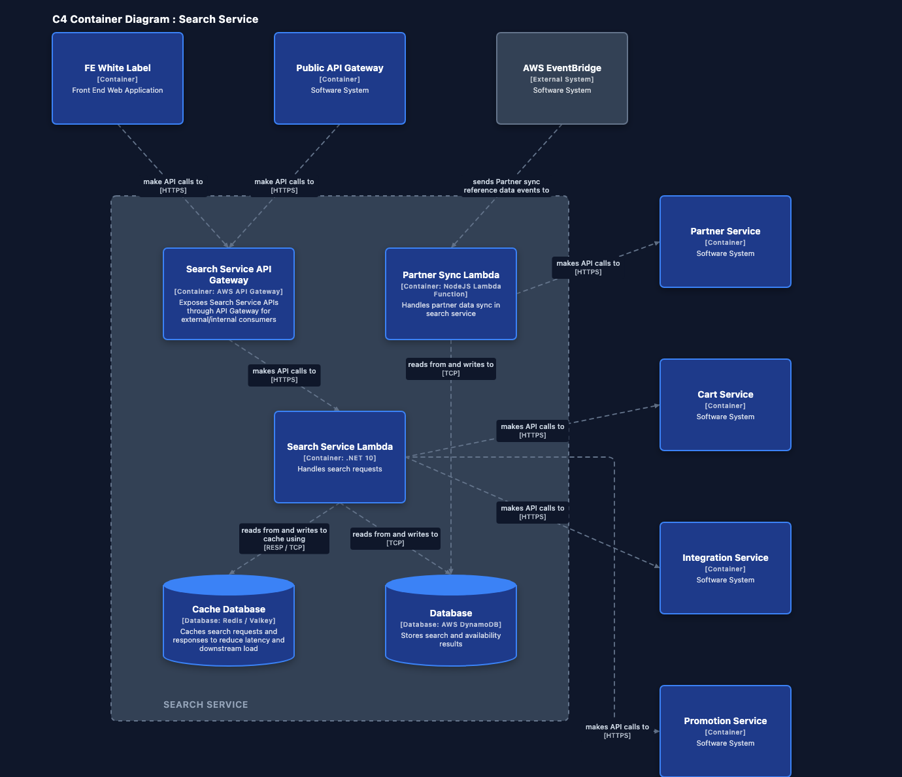
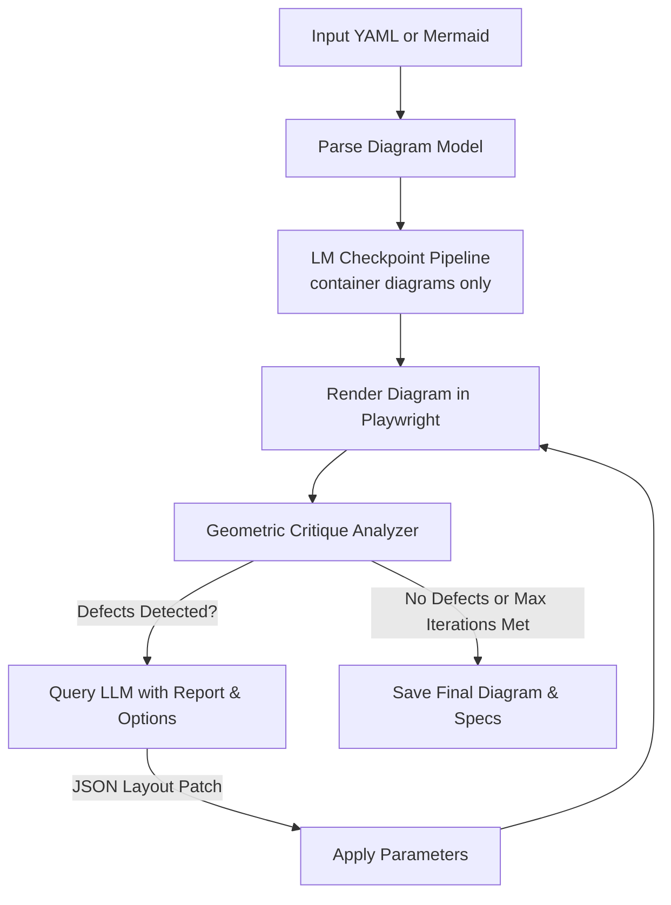

# Nudge 📐🤖

[](https://github.com/cookie-bytes/nudge/actions/workflows/test.yml)
[](LICENSE)
[](package.json)

**AI-Driven Architecture Diagram Layout Optimizer**

Nudge is a command-line tool that automatically produces clean, publication-ready C4 Model architecture diagrams. It combines a deterministic custom layout engine for container diagrams with an iterative LLM feedback loop that detects and fixes geometric defects—overlapping components, edge-to-node crossings, and tight spacing—using locally-running AI.

---

## Example Output



---

## How It Works

Nudge runs on a **Critic-Loop** architecture:



1. **Ingestion**: Parses C4 Context or C4 Container diagrams from `.mermaid` or `.yaml` specifications.
2. **LM Checkpoint Pipeline** *(container diagrams only)*: Before the optimization loop, two LLM checkpoints verify and correct zone assignments and node ordering within zones — ensuring callers are above the boundary, callees below, and external nodes are ordered to minimise edge crossings.
3. **Rendering**: Playwright loads the diagram template and executes the layout pipeline:
   - **Flat diagrams (C4Context)**: Arranged dynamically via **ELKjs** (layered algorithm).
   - **Nested diagrams (C4Container)**: Arranged via a custom, deterministic **Container Layout Engine** (see below).
4. **Criticism**: Measures DOM bounding boxes to calculate geometric defects (overlaps, edge-node crossings, edge-label collisions, aspect ratio).
5. **Correction**: Feeds the critique report to a local LLM, requesting layout property adjustments or ordering swap overrides.
6. **Iteration**: Repeats up to 4 times or until a clean layout is produced.

---

## Layout Engines & Algorithms

Nudge uses two distinct engines depending on the C4 model type:

### 1. Flat C4 Context Layout (ELKjs)
Flat context diagrams are laid out using the **Eclipse Layout Kernel (ELKjs)** with a layered algorithm. The critic loop iteratively tunes layout properties like spacing, node distances, and routing directions by prompting the LLM.

### 2. Nested C4 Container Layout (Custom Engine)
Container diagrams containing boundary blocks bypass ELKjs entirely and use a custom deterministic layout pipeline:

- **Phase 1: Kahn Layering (Boundary Interior)**: Children of the boundary are sorted into horizontal layers using a modified Kahn's topological sort. Nodes receiving cross-boundary edges are automatically seeded as entry nodes in the top row (Layer 0); unconnected utility nodes are pushed down to minimise clutter. Cycles are silently broken by appending remaining nodes to a final layer.
- **Phase 2: Zone Classification & Connectivity Sorting**: External nodes are classified into layout zones — callers go **above**, callees go **below**, and overflow nodes spill into **left** and **right** columns. Each zone is then automatically sorted by the average layer/column index of the internal nodes it connects to, so external nodes align visually with their counterparts inside the boundary with minimal edge crossings. LLM override commands (`zoneOverrides`, `SWAP_NODE_ORDER`, `SHIFT_ZONE`) from the checkpoint pipeline are applied on top of the automatic sort.
- **Phase 3: Orthogonal Edge Routing**: Every cross-boundary edge is routed by spatial relationship — straight vertical lines for vertically-aligned endpoints, L-shapes for targets directly above or below, and U-shape arcs for the fallback case. Bend points are post-processed into SVG quadratic bezier curves with a 10 px corner radius.
- **Phase 4: Rule-Based Edge Label Placement**: Relationship labels are placed along the edge using four strategies evaluated in order: (0) straight-line midpoint, (1) target-anchored, (2) source-anchored, (3) gutter-clearance segment scoring. Every strategy checks for collision against both node bounding boxes **and previously-placed labels**, so duplicate-text labels on co-terminal edges are always separated. Long labels wrap automatically; technology notes (e.g. `[HTTPS]`) are rendered in a smaller, semi-transparent style beneath the main text.

### LM Checkpoint Pipeline (Container diagrams)
Before the 4-iteration optimization loop runs, two LLM checkpoints fire once:

- **Checkpoint 1 — Zone Verification**: The LLM reviews the computed zone plan and may issue `zoneOverrides` (move a node to a different zone) or `SWAP_NODE_ORDER` commands.
- **Checkpoint 2 — Ordering Verification**: If Checkpoint 1 changed any zones, the plan is recomputed first. The LLM then checks whether the left-to-right ordering within each zone minimises edge crossings, and may issue further `SWAP_NODE_ORDER` or `SHIFT_ZONE` commands.

All override commands are written to `diagramModel._layoutOverrides` and applied on every subsequent render pass.

---

## Features

- 🎯 **Automatic Defect Detection**: Finds overlapping components, intersecting arrows, edge-label collisions, and poor aspect ratios.
- 🔄 **Critic Loop**: Continuous optimization loop that improves layout quality iteratively (up to 4 passes).
- 🤖 **LM Checkpoint Pipeline**: Two pre-render LLM checkpoints verify and correct zone assignments and node ordering for container diagrams before the main loop begins.
- 🎨 **Supports Mermaid & YAML**: Seamless support for C4 diagrams in `.mermaid`/`.mmd` syntax and structured `.yaml` specifications.
- 📏 **Standardized Sizing & Grid**: All nodes are standardized to a width of `200px`. Heights: `200px` for Person, `140px` for Container/Database/External, `80px` for MessageBus — ensuring consistent alignment and a clean grid.
- 💬 **3-Line Descriptions**: Node descriptions support a 3-line clamp, providing space for detailed technical notes without clipping.
- 🏷️ **Collision-Aware Label Placement**: Edge labels check four strategies sequentially — straight-middle, target-anchored, source-anchored, and gutter-clearance segment scoring. Each strategy checks for collision against both node boxes and already-placed labels, preventing co-terminal edges from stacking their labels on top of each other.
- 🔌 **Orthogonal Edge Routing**: Cross-boundary edges route via L-shape, straight-line, or U-shape paths; corners are smoothed with quadratic bezier curves.
- 🌐 **Connectivity-Based Zone Sorting**: External nodes are auto-sorted to align with the internal layer or column they connect to, reducing edge crossings without LLM intervention.
- 🏠 **No Cloud Dependencies**: Runs fully on your machine using Playwright and a local LLM backend (like LM Studio). The layout engine (ELKjs) is bundled locally via `npm install` — no CDN calls at runtime.

---

## Prerequisites

Before using Nudge, make sure you have:

1. **Node.js**: Version 18 or newer.
2. **Playwright Browsers**: Required for rendering diagrams.
   ```bash
   npx playwright install chromium
   ```
3. **Local LLM Server**: A running OpenAI-compatible API server on `http://localhost:1234` (e.g., [LM Studio](https://lmstudio.ai/)).
   - **Recommended Models**: `google/gemma-2-9b-it`, `google/gemma-4-12b` or other reasoning models.

---

## Installation

Clone the repository and install dependencies:

```bash
git clone https://github.com/cookie-bytes/nudge.git
cd nudge
npm install
```

---

## Usage

Start your local LLM server in LM Studio (default port `1234`), then run Nudge.

> **Custom API endpoint**: if your LLM server runs on a different host or port, set the `NUDGE_LLM_API` environment variable:
> ```bash
> export NUDGE_LLM_API=http://localhost:5000
> ```

### Optimize default examples
```bash
npm start
```
By default, this will optimize the sample layout at `examples/system_context.yaml`.

### Run on a custom Mermaid or YAML file
Provide the path to your diagram file as an argument:
```bash
node src/cli.js examples/internet_banking.mermaid
```

### Run the test suite
```bash
npm test
```
Renders all diagrams in `test/` and grades them. If a local LLM is unavailable, grading falls back to a math-based scorer automatically — no test is skipped.

### Outputs
Nudge writes all outputs to the `.nudge/` directory:
- **`iteration_N.png`**: Screenshot at each optimization pass.
- **`optimized.png`**: Final optimized layout as a PNG.
- **`optimized.svg`**: Final optimized layout as a scalable SVG.
- **`layout.cache.json`**: The final ELKjs options patch (flat C4 Context diagrams).

---

## Folder Structure

```
├── .nudge/                 # Output directory for rendered iterations and final exports
├── docs/                   # Documentation and example images
├── examples/               # Example C4 model YAML and Mermaid diagrams
├── scripts/                # Developer utilities (visual symbol match harnesses)
├── src/
│   ├── cli.js              # CLI entry point, LM checkpoint pipeline, and optimization loop
│   ├── critic.js           # Geometric evaluation and LLM API connector
│   ├── mermaid_parser.js   # Parse Mermaid C4 diagram structures
│   ├── render.html         # Layout engine and SVG rendering template (loaded by Playwright)
│   └── utils.js            # Shared fetch-with-timeout helper
├── test/                   # Test diagrams (.mermaid) and test runner
├── test_outputs/           # Rendered PNGs, SVGs, and test result summary from npm test
├── LICENSE                 # MIT License
└── package.json            # Node project configuration
```

---

## Contributing

Contributions are welcome. See [CONTRIBUTING.md](CONTRIBUTING.md) for setup instructions, how to run tests, and PR guidelines.

---

## License

This project is licensed under the [MIT License](LICENSE).
