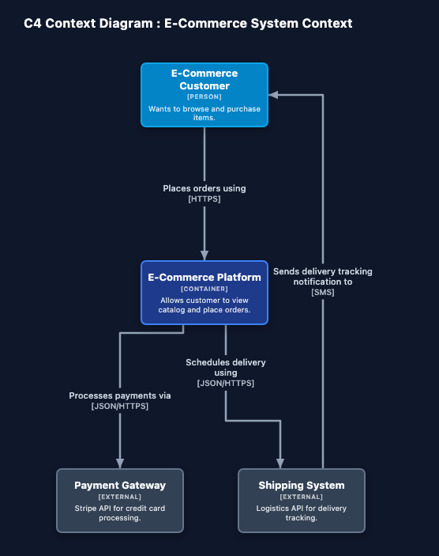
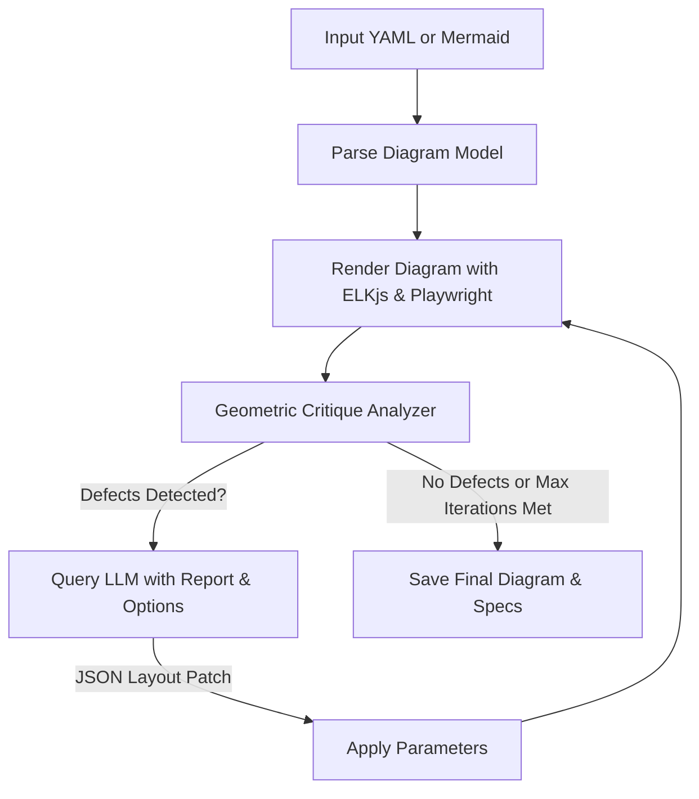

# Nudge 📐🤖

[](https://github.com/cookie-bytes/nudge/actions/workflows/test.yml)
[](LICENSE)
[](package.json)

**AI-Driven Architecture Diagram Layout Optimizer**

Nudge is a command-line tool that automatically optimizes the layout parameters of C4 Model architecture diagrams using a local Large Language Model (LLM) feedback loop. It analyzes diagram layouts for geometric defects—such as overlapping components, edge-to-node crossings, and tight spacing—and iteratively queries an LLM to find the optimal ELKjs (Eclipse Layout Kernel) properties.

---

## Example Output



---

## How It Works

Nudge uses a **Critic-Loop** architecture:



1. **Ingestion**: Parses C4Context Mermaid diagrams or YAML-defined system models.
2. **Rendering**: Uses Playwright to render the diagram layout dynamically via ELKjs.
3. **Criticism**: Measures bounding boxes to calculate overlaps, edge-node crossings, edge-label collisions, and aspect ratio.
4. **Correction**: Feeds the geometric report to a local LLM, requesting updated ELKjs properties (e.g., `elk.spacing.nodeNode`, `elk.layered.spacing.nodeNodeBetweenLayers`).
5. **Iteration**: Repeats up to 4 times or until a clean layout is produced.

---

## Features

- 🎯 **Automatic Detection**: Finds overlapping components, intersecting arrows, edge-label collisions, and cramped nodes.
- 🔄 **Critic Loop**: Continuous optimization loop that improves layout quality iteratively.
- 🎨 **Supports Mermaid & YAML**: Seamless support for C4Context `.mermaid`/`.mmd` files and structured `.yaml` system specifications.
- 🏷️ **Smart Label Placement**: Edge labels are placed on the segment with the most clearance from nearby nodes, and long labels wrap to multiple lines automatically.
- 🔌 **Side-Port Routing**: Backward and side-routed edges connect on the correct left/right port even when source and target nodes are vertically aligned.
- 🏠 **100% Local**: Runs fully on your machine using Playwright and a local LLM backend (like LM Studio).

---

## Prerequisites

Before using Nudge, make sure you have:

1. **Node.js**: Version 18 or newer.
2. **Playwright Browsers**: Required for rendering diagrams.
   ```bash
   npx playwright install chromium
   ```
3. **Local LLM Server**: A running OpenAI-compatible API server on `http://localhost:1234` (e.g., [LM Studio](https://lmstudio.ai/)).
   - **Recommended Models**: `google/gemma-2-9b-it`, `google/gemma-4-12b` or other reasoning models.

---

## Installation

Clone the repository and install dependencies:

```bash
git clone https://github.com/cookie-bytes/nudge.git
cd nudge
npm install
```

---

## Usage

Start your local LLM server in LM Studio (default port `1234`), then run Nudge.

> **Custom API endpoint**: if your LLM server runs on a different host or port, set the `NUDGE_LLM_API` environment variable:
> ```bash
> export NUDGE_LLM_API=http://localhost:5000
> ```

### Optimize default examples
```bash
npm start
```
By default, this will optimize the sample layout at `examples/system_context.yaml`.

### Run on a custom Mermaid or YAML file
Provide the path to your diagram file as an argument:
```bash
node src/cli.js examples/internet_banking.mermaid
```

### Outputs
Nudge outputs optimized diagrams and execution specs in the `.nudge/` directory:
- **`layout_iteration_X.png`**: Rendering screenshot at each optimization pass.
- **`optimized_diagram.png`**: The final optimized layout diagram.
- **`layout_options.json`**: The final optimized ELKjs options patch.

---

## Folder Structure

```
├── .nudge/                 # Output directory for rendered iterations
├── examples/               # Example C4 model YAML and Mermaid diagrams
├── src/
│   ├── cli.js              # CLI entry point and orchestration loop
│   ├── critic.js           # Geometric evaluation and LLM API connector
│   ├── mermaid_parser.js   # Parse Mermaid C4 diagram structures
│   ├── render.html         # ELKjs rendering template loaded in Playwright
│   └── test_coords.js      # Internal coordinate helpers
├── LICENSE                 # MIT License
└── package.json            # Node project configuration
```

---

## Contributing

Contributions are welcome. See [CONTRIBUTING.md](CONTRIBUTING.md) for setup instructions, how to run tests, and PR guidelines.

---

## License

This project is licensed under the [MIT License](LICENSE).
