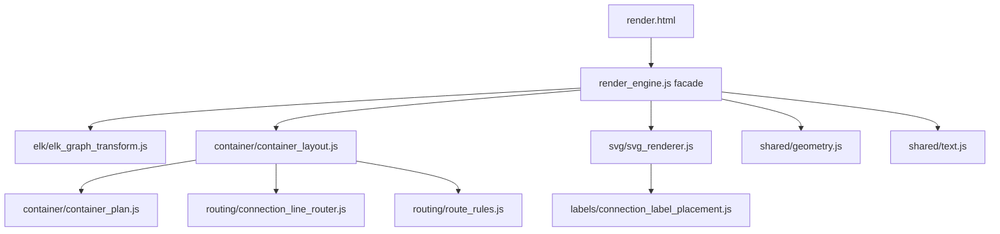

# Architectural Refactor Blueprint & Implementation Guide: Nudge Renderer

Baseline checked: `npm run test:refactor` is green against `HEAD` for all 15 fixtures when run outside the macOS sandbox. No renderer, fixture, or rig changes were made while preparing this blueprint.

## 1. Current-State Analysis

`src/render_engine.js` currently mixes these responsibilities:

- Public browser API: `window.renderDiagram(diagramData)` and `window.computeContainerPlan(diagramData)`.
- Diagram-type dispatch: C4 Context Diagram via ELK Layout, C4 Container Diagram via custom Container Layout Engine.
- ELK graph transformation: rank solving, source-level `Rule` handling, ELK layout options, port creation, edge labels, hierarchy/ancestor edge placement.
- Container planning: Boundary child discovery, Kahn Layering, barycenter ordering, Utility Row insertion, External Zone classification, Connectivity Sort, Layout Override application.
- Container geometry: Boundary sizing, message bus width step-up, route corridor padding, child placement, external element placement.
- Routing: hub port assignment, side corridor assignment, Route Candidate generation, route conflict scoring, Lane Reservation, Second-Pass Rerouting, Route Hint handling.
- SVG drawing: title, boundaries, Architecture Element shapes, Connection Lines, arrow direction, Connection Labels.
- Geometry helpers: text measurement, wrapping, flattening, segment/box collision helpers, line intersection helpers.

Domain-level responsibilities:

- Architecture Element classification and presentation.
- Boundary interior layout.
- Utility Row behavior for Database and Message Bus elements.
- External Element zone placement.
- Relationship-to-Connection Line routing.
- Connection Label placement.
- Layout Override interpretation.

Implementation-level concerns:

- `nodes`, `edges`, `children`, `sections`, `ports`, `x`, `y`, `width`, `height`.
- ELKjs graph schema, port namespace quirks, `layoutOptions`.
- SVG DOM creation, CSS classes, marker attributes.
- Browser globals and Playwright-facing return shape.

Riskiest parity areas:

- Any ordering change in arrays, Maps, `sort` tie-breakers, or object key insertion.
- Text measurement, wrapping, label dimensions, label placement, and final SVG element order.
- Route scoring weights, route candidate order, lane reservation, and rerouting thresholds.
- ELK port IDs, port namespace duplication, hierarchy edge placement, and rank mutation through global `ranks`.
- DOM/script loading changes in `render.html`.

## 2. Ubiquitous Language Mapping

Use these names in new domain-facing modules and docs:

| Legacy/generic | Domain term for new modules |
| --- | --- |
| node/entity/box | Architecture Element |
| edge/rel declaration | Relationship |
| rendered edge/connector | Connection Line |
| edge label | Connection Label |
| group/container box | Boundary |
| custom layout | Container Layout Engine |
| special row/sink row | Utility Row |
| side/lane/area | External Zone |
| path option | Route Candidate |
| route style | Route Intent |
| line spreading | Lane Reservation |
| label routing | Label Placement |

Preserve these implementation identifiers where they already exist or mirror renderer/ELK data shapes:

`nodes`, `edges`, `children`, `sections`, `ports`, `sources`, `targets`, `labels`, `bendPoints`, `startPoint`, `endPoint`, `x`, `y`, `width`, `height`, `layoutOptions`, `ranks`, `edgeQuality`, SVG class names, ELK option names.

## 3. Target Architecture

Keep the browser runtime simple: classic scripts loaded by `src/render.html`, with modules attaching pure helpers to `window.NudgeRenderer`. Avoid bundling or ESM until parity is stable.



Proposed modules:

- `src/renderer/shared/text.js`: `measureTextWidth`, `wrapText`, label constants.
- `src/renderer/shared/geometry.js`: point/segment/box helpers, flattening helpers if safe.
- `src/renderer/elk/layout_policies.js`: C4 Context/C4 Container ELK layout policies.
- `src/renderer/elk/elk_graph_transform.js`: `transformToElkGraph`.
- `src/renderer/container/container_plan.js`: `buildContainerZonePlan`, override appliers.
- `src/renderer/container/container_layout.js`: container sizing and placement orchestration.
- `src/renderer/container/utility_row_rules.js`: Database and Message Bus row behavior.
- `src/renderer/routing/connection_line_router.js`: `routeEdge`, lane reservation, rerouting orchestration.
- `src/renderer/routing/route_candidate_rules.js`: ordered Route Candidate Rule Objects.
- `src/renderer/routing/route_specifications.js`: route predicates and conflict specifications.
- `src/renderer/svg/architecture_element_shapes.js`: existing `shapeStrategies`.
- `src/renderer/svg/svg_renderer.js`: `drawGraph`.
- `src/renderer/labels/connection_label_placement.js`: label candidate scoring and placement.

Rule Objects are appropriate for decisions that are currently long ordered branches:

- ELK layout policies by diagram type.
- Utility Row insertion and sizing.
- Route Candidate generation.
- Shape rendering by Architecture Element type.
- Connection Label placement attempts.

Specification Pattern is appropriate for reusable predicates:

- `isBoundaryChild(id)`.
- `isUtilityRowElement(node)`.
- `isLocalMessageBus(node)`.
- `isDirectDatabaseDrop(edge, context)`.
- `isSameParentRelationship(edge, nodeMap)`.
- `isCrossHierarchyRelationship(edge, nodeMap)`.
- `hasConnectionLineElementCrossing(route, context)`.
- `canBundleRelationships(edgeA, edgeB, context)`.
- `isRouteIntentActive(routeHint)`.

## 4. Rule and Specification Design

Rule Object shape:

```js
{
  name: 'DirectDatabaseDropRule',
  applies(edge, context) { return trueOrFalse; },
  produce(edge, context) { return routeOrNull; }
}
```

Specification shape:

```js
{
  name: 'DirectDatabaseDropSpecification',
  isSatisfiedBy(edge, context) { return trueOrFalse; }
}
```

Preferred context shape:

```js
{
  diagramData,
  options,
  plan,
  geometry,
  getAbs,
  getSz,
  getNode,
  childIds,
  allEdges,
  incomingEdges,
  outgoingEdges,
  routedEdgeSegments,
  constants
}
```

Rules may mutate only the local result they own, such as a returned route object or a target SVG group. Shared state mutation must remain in orchestration code until a later cleanup phase. For parity, candidate arrays must preserve current order exactly, tie-breakers must be copied exactly, and cleanup must not simplify duplicate geometry helpers until the rig proves equivalence after each extraction.

## 5. Incremental Refactor Plan

Each phase must start and end with:

```bash
npm run test:refactor
```

If Chromium fails in the sandbox, rerun the same command with normal host permissions. Expected success is every fixture reporting `json=same svg=same`.

| Phase | Files/modules | Code to move | Risk | Rollback |
| --- | --- | --- | --- | --- |
| 0 | none | Run baseline rig only | none | none |
| 1 | `src/renderer/namespace.js`; update `render.html` script order | Define `window.NudgeRenderer = window.NudgeRenderer || {}`; no behavior | low | remove script tag/file |
| 2 | `shared/text.js` | `MAX_LABEL_WIDTH`, `LINE_HEIGHT`, `BOUNDARY_H_PAD`, `measureTextWidth`, `wrapText`; leave aliases in facade if needed | medium: text metrics | restore functions inline |
| 3 | `shared/geometry.js` | Pure helpers used outside closures: `pointToBoxDist`, `lineSegmentIntersectsRect`, `flattenNodes`, `flattenEdges` | medium: flatten offsets | restore inline helpers |
| 4 | `elk/layout_policies.js` | `DIAGRAM_LAYOUT_POLICIES` unchanged | low | move object back |
| 5 | `elk/elk_graph_transform.js` | `transformToElkGraph` and its private helpers; keep `ranks` contract explicit | high: ELK parity | revert file and call site |
| 6 | `container/container_plan.js` | `buildContainerZonePlan` exactly, including current behavior that computes but does not use `hasExternalIn` | high: ordering | restore function inline |
| 7 | `container/plan_summary.js` | `computeContainerPlan` wrapper logic | low | restore wrapper inline |
| 8 | `container/utility_row_rules.js` | Message Bus width step-up and paired/corner row predicates, initially as pure helper functions | medium | inline helper bodies |
| 9 | `container/container_layout.js` | Boundary sizing, child placement, external placement, output graph assembly; keep routing nested/called as imported helper only after parity | high | revert call site |
| 10 | `routing/route_geometry.js` | Route point/segment conversion and overlap/crossing helpers currently inside layout | high: route scoring | restore nested helpers |
| 11 | `routing/route_specifications.js` | `canBundleEdges`, direct drop predicates, side/zone predicates | high: predicate drift | restore exact closures |
| 12 | `routing/route_candidate_rules.js` | Extract route candidate generators one at a time: side external, target-facing, hinted orthogonal, standard route | very high | revert last moved rule only |
| 13 | `routing/connection_line_router.js` | `routeEdge`, `reserveRouteLanes`, `improveRoutedSections`, `evaluateRouteSet` after their helpers are stable | very high | revert entire router module |
| 14 | `svg/architecture_element_shapes.js` | Existing `shapeStrategies`, `getNodeTypeLabel`, `appendNodeText` | medium: SVG order/attributes | restore object inline |
| 15 | `labels/connection_label_placement.js` | Label placement attempts, scoring, and placed-label bookkeeping; extract after SVG shapes | very high: SVG label coords | restore label block inline |
| 16 | `svg/svg_renderer.js` | `drawGraph` orchestration once shapes and labels are imported | high | restore `drawGraph` inline |
| 17 | cleanup only | Remove unused aliases, normalize comments, add module docs | medium | revert individual cleanup |

Do not combine high-risk phases. For route and label phases, move one helper/rule per commit-sized slice and run the rig after each move.

## 6. Test Rig Usage During Refactor

Run the rig:

- Before the first renderer change.
- After adding an unused module or script tag.
- After every function extraction.
- After every call-site change.
- Before committing or handing off.
- With `--baseline-ref <legacy-ref>` if the intended legacy renderer is not current `HEAD`.

Failure workflow:

1. Open `test_outputs/refactor_rig/refactor_test_results.json`.
2. Find the first `FAILED` summary entry.
3. Compare `jsonDiff` first. JSON differences usually indicate geometry, route, label coordinate, or return-shape drift.
4. Compare `svgDiff` next. SVG-only differences usually indicate DOM order, attributes, label text layout, class names, or path string formatting.
5. Fix the candidate renderer. Do not modify fixtures, normalize away differences, weaken byte comparison, or change the rig to pass.

The rig is intentionally strict because this is a behavior-preserving refactor. Byte-for-byte parity is the guardrail that lets modules be extracted without silently redesigning the renderer.

## 7. Future Extension Guidelines

To add a new rendering rule after the refactor:

- Add a Rule Object to the relevant ordered rule array.
- Give it a Ubiquitous Language name, such as `DirectDatabaseDropRule` or `MessageBusHubPortRule`.
- Keep implementation fields named like the renderer data shape: `nodes`, `edges`, `sections`, `ports`, `x`, `y`.
- Use Specifications for predicates shared by multiple rules.
- Append new rules deliberately; changing rule order changes behavior.
- Add or update characterization fixtures before changing behavior, then use the normal test suite. The refactor rig is for parity, not approval of intentional visual changes.

Naming convention:

- Domain modules: `architecture_element_*`, `connection_line_*`, `connection_label_*`, `external_zone_*`, `utility_row_*`.
- Implementation modules: `elk_*`, `svg_*`, `route_geometry`, `flatten_*`.
- Public return shapes and CSS classes stay unchanged unless a separate behavior-change task explicitly requires it.
